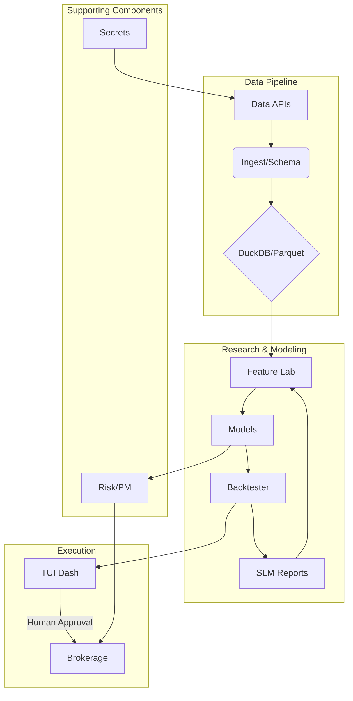

```markdown
# Sovereign Local Quant (SLQ)

```
███████╗██╗     ██████╗
██╔════╝██║     ██╔══██╗
███████╗██║     ██║  ██║
╚════██║██║     ██║  ██║
███████║███████╗██████╔╝
╚══════╝╚══════╝╚═════╝
```

**A local-first, AI-augmented toolkit for quantitative financial research.**

## Overview

Sovereign Local Quant (SLQ) is a decision-support copilot for quantitative financial research. It is designed to be a private, secure, and powerful tool for researchers and traders who want to leverage the power of large language models (LLMs) and modern machine learning techniques without sacrificing control over their data and infrastructure.

This project is **not** an automated trading system. It is a research tool that helps you generate ideas, backtest strategies, and manage your portfolio. You are always in control.

## Features

*   **Local-First & Sovereign:** Your data, models, and code remain on your local machine. This ensures complete privacy, control, and eliminates reliance on external cloud services for core processing.
*   **AI-Augmented Research:** Leverage Sovereign Local Models (SLMs) to act as your research copilot. The SLM can help with:
    *   **Feature Generation:** Automatically write Python code for new technical indicators or data transformations.
    *   **Experiment Design:** Define and run complex backtesting scenarios using natural language.
    *   **Reporting:** Summarize backtest results and generate insights.
*   **Modular & Extensible:** The system is built with a clear, modular architecture. It's easy to add new data sources, machine learning models, or custom features.
*   **End-to-End Reproducibility:** Every action, from data ingestion to model training, is logged with the exact code and data used. This ensures that all results are fully reproducible.
*   **Human-in-the-Loop:** SLQ is a decision-support tool, not a black box auto-trader. It provides you with the data and analysis you need to make informed decisions, but you always have the final say.
*   **Interactive TUI:** A rich, user-friendly Terminal User Interface (TUI) provides a dashboard for interacting with all parts of the system.

## Technology Stack

| Layer                 | Technology                                       |
| --------------------- | ------------------------------------------------ |
| **Language**          | Python 3.9+                                      |
| **Data Storage**      | DuckDB & Parquet                                 |
| **ML Frameworks**     | scikit-learn, LightGBM, Statsmodels              |
| **Data Handling**     | Pandas, NumPy, PyArrow                           |
| **CLI/TUI**           | Click, Rich                                      |
| **LLM Integration**   | (Designed for local GGUF models)                 |
| **Reporting**         | Jinja2, HTML                                     |

## System Architecture



## Getting Started

1.  **Set up the Environment**

    Ensure you have Python 3.9+ installed. Then, run the setup script:

    ```bash
    bash setup.sh
    ```

2.  **Activate the Virtual Environment**

    ```bash
    source .venv/bin/activate
    ```

3.  **Configure Secrets**

    Copy the example `.env` file and add your API keys.

    ```bash
    cp secrets/.env.example secrets/.env
    # Now edit secrets/.env with your keys
    ```

4.  **Run the CLI**

    You can now use the command-line interface to run different parts of the system.

    ```bash
    python cli.py --help
    ```

## Usage

The primary way to interact with SLQ is through its interactive Terminal User Interface (TUI).

To launch the TUI, run:
```bash
python cli.py
```

This will open the main dashboard, from which you can navigate to all of the system's core functions:

| Menu Option          | Description                                                              |
| -------------------- | ------------------------------------------------------------------------ |
| **Ingest Data**      | Download historical market data from APIs like Yahoo Finance.            |
| **Train and Backtest** | Train a model on a specific stock and run a backtest to evaluate it.     |
| **View Reports**     | List and view the HTML reports generated from your backtesting experiments. |
| **Exit**             | Close the application.                                                   |

### Command Line Arguments

You can also run specific tasks directly from the command line. For example, to run the data ingestion process directly:

```bash
python src/ingestion/yfinance_connector.py
```

## The Sovereign Local Model (SLM)

A core concept of SLQ is the use of a Sovereign Local Model (SLM) as a research copilot. This is a Large Language Model (LLM) that runs entirely on your local machine.

The SLM is designed to help you with tasks like:

*   **Generating Feature Code:** Ask the SLM to write Python code for a new technical indicator, and it will generate a new module in the `src/features/generated/` directory.
*   **Creating Experiment Manifests:** Describe a backtesting scenario in natural language, and the SLM will generate the configuration file needed to run it.
*   **Drafting Risk Reports:** The SLM can help you summarize and interpret the results of your backtests.

**Note:** The SLM is not a forecasting tool. It is a code and text generation tool that helps you automate your research workflow.

## Project Structure

The project follows a modular structure designed for clarity and extensibility.

```
/
├── .gitignore
├── README.md
├── cli.py
├── config.py
├── data/
│   └── processed/
├── docs/
├── experiments/
├── requirements.txt
├── secrets/
│   └── .env.example
├── src/
│   ├── backtesting/
│   ├── features/
│   ├── ingestion/
│   ├── modeling/
│   ├── reporting/
│   ├── slm/
│   └── utils/
└── tests/
```

For a detailed description of each file and directory, please see the `Project_Directory.md` file.

## Modeling Stack

SLQ is designed to be flexible and support a wide range of modeling techniques. The core modeling stack includes:

*   **Forecasting/Classification:** LightGBM/XGBoost, ARIMA/TBATS, N-BEATS/TFT, DeepAR.
*   **Regime Detection:** Hidden Markov Models, spectral clustering.
*   **Ensembles:** Stacking and blending of different models.

For a more detailed overview of the modeling stack, please see `Project_Directory.md`.

## Contributing

Contributions are welcome! Please see the `CONTRIBUTING.md` file for more information.

## License

This project is licensed under the MIT License. See the `LICENSE` file for more information.
```
